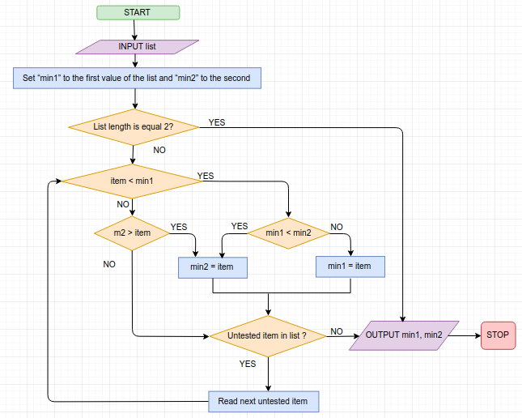
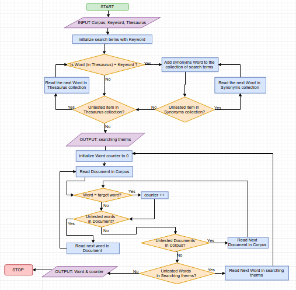

## Task 1: Finding 2 min valuses

## Task 2: Complexity

### Question #1.
 She would need to compare Northern Liberties and Fairmount before finding "Kensington".

### Question #2.
 She would need to compare Northern Liberties, Schuylkill, University City and South Philadelphia before determining that "Roxborough" it's not there.

### Question #3.
Firsr 3 neighborhoods linear search require fewer comparisons than binary search.

### Question #4.
linear search binary search

|                | Linear search | Binary search |
| -------------- | ------------- | ------------- |
| Bella Vista    |       1       |       4       |
| Center City    |       2       |       3       |
| Chestnut Hill  |       3       |       4       |

  
### Question #5.
1. In worst case, namber of operations will be 150 (n * 10times);

2. For sort elements we will spent 60 operations (n * log2 n);

3. For binary searches, in the worst case it would require 40 operations (log2 n);

4. It would be better sort the elements and then conduct 10 binary searches.
(for sorting binary search we spent 100 operations (15 * log2 15 + log2 15), whereas on linary we spent 150 operations)

## Task 3: greedy algorithm

### Question #1.
According to the greedy algorithm, from the house I will go to the Bank, since the shortest way to it - 3. Then I will go to the Post Office (the length of the way to the post office from the bank is 4, whereas the distance to the grocery store is biggest - 5). Since I have already visited the Bank and the House, from the Post Office there is only one way left - to the Grocery Store (7), and from the Grocery Store I will go Home (5).

### Question #2.
bank -> post -> grocery -> home;
total distance traveled is 19;

### Question #3.
I need to make 6 comparisons to find solution (? or not :) ).
After adding a fourth location i would need to make 10 comparisons (? or not :) ).
ASSUMPTION: (n-1) + (n-2) + ... + (n - (n-1)) (no eto ne tochno)

### Question #4.
Using a brute force approach it is 24 comparisons

### Question #5.
The shorter path is:
post -> bank -> grocary -> home
total distance will be 18;

## Task 4: Describing Algorithms Using a Flowchart

think about: can crate the same patter for iteratuing list in flowchart?
